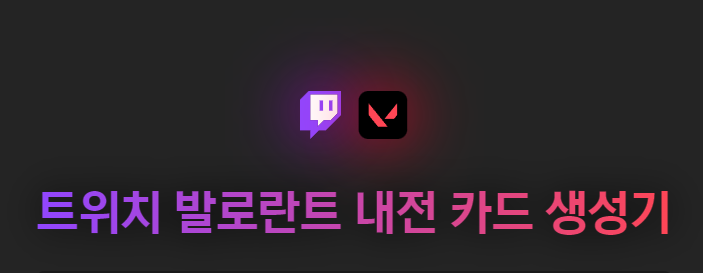

### **Twitch 한국 서비스 종료로 인해 무산된 토이 프로젝트입니다.**

 
 

<link href="https://cdnjs.cloudflare.com/ajax/libs/github-markdown-css/5.1.0/github-markdown.css" rel="stylesheet">

	

## Where is this coming from?

- 이런 짤방을 간편하게 만들어주는 사이트를 만들어보자.
- 디자인을 조금 더 깔끔하게 하고, 아웃풋을 이미지 또는 HTML 형태로 저장할 수 있게 하자.

## Input/Output
### **Input**
- ‘트위치 스트리머 이름’
- 선택된 스트리머의 티어 (A, B, C, D, E 중 하나)
- 선택된 스트리머의 팀 (공격팀, 수비팀) 고르기
    - cf. 팀원 변경이 잦으므로 큰 의미는 없을 것으로 예상
- 선택된 스트리머의 발로란트 세부 데이터 입력

### **Output**
- 스타일링된 카드형 HTML 문서

## Features
- 기본 템플릿 기능
    - A, B, C, D, E 티어로 나뉘어 져 있는 폼 형태
- 제목 붙이기 기능
    - 최대 x 글자의 제목을 설정하여 템플릿 상단부에 표시
- 스트리머 검색 기능
    - 스트리머 이름, 프로필 이미지 불러오기
- 진영 선택 기능
    - 선택한 스트리머의 진영 (공격/수비팀)을 선택하기
- 요원 이미지 삽입 기능 (선택)
    - 선택한 스트리머에 작은 요원 아이콘을 삽입
    - 최대 3개까지 모스트 요원을 보여줄 수 있다.
- 최고/현재 티어 삽입 기능 (선택)
    - MAX/MIN 으로 나누어 간단히 티어 아이콘을 삽입
- 결과물 저장 기능
    - 이미지 파일로 저장하는 버튼 추가
- 결과물 복사 기능
    - HTML/이미지 파일을 클립보드에 복사하는 버튼 추가

## UI/UX
### Design thinking

- 가장 먼저 할 것과 가장 마지막에 할 것은 무엇인가?
    - 가장 먼저 할 일 : **제목 붙이기 (디폴트 제목: {날짜/시간대} 발로란트 내전)**
    - 가장 마지막에 할 일 : **결과물 저장 혹은 복사하기**
- 두 번째로 할 일과 그 이후는?
    1. 스트리머 선택하기
        - 순서대로 선택되어 랭크에 입력되는 것은 불편하다.
        - 스트리머 이름을 검색해서 선택한다.
            - 선택된 스트리머의 데이터를 받아온다.
            - 받아온 데이터는 스토리지에 저장된 상태로 둔다.
                - 이 부분 어떻게 해결할지 고민할 것.
            - 트위치 API를 사용해야 할 것 같다.
                - 정확한 방법을 알아볼 것.
        - [UX] 드래그 & 드롭을 지원해야 한다.
            - 검색되고 선택되어 스토리지에 저장된 스트리머 프로필을 드래그하여 결과물 폼의 빈 티어창에 드롭할 수 있어야 한다.
        - 스트리머의 세부 데이터를 입력한다.
            - 발로란트 닉네임, 티어, 모스트 요원, 최고 티어와 현재 티어
    2. 선택된 스트리머를 티어, 진영을 정하고 입력한다.
        - 이미 티어, 진영에 입력되어 있으면 차선책으로 입력된다.
            - 티어에 1명이 있고 같은 진영을 선택했으면 다른 진영으로 입력됨
            - 티어에 2명이 있으면 입력이 안됨
        - 모든 칸에 스트리머가 입력되어 있으면 입력 칸이 얼려진다.

## Work flow
1. 디자인 구상하기
    - 결과물 예시부터 디자인
    - UI 만들기
2. 트위치 API로 검색 기능 만들기
    [[마켓만들기] 키워드 검색 기능(api query, 검색어 하이라이팅)](https://velog.io/@ongddree/마켓만들기-검색-기능api-onChange-하이라이팅)
    - 드롭다운 검색 기능
    - 받아올 유저 데이터: 스트리머 이름(display_name), 프로필 이미지(profile_image_url),

## Twitch API 사용법
[* 트위치 API 가이드 * - 트위치개발 채널](https://arca.live/b/twitchdev/44459710)
- 만료 기간은 초(second) 단위로, 약 2달이다.

### API 사용법

📌 **자주 사용되는 API**
1. 유저 조회
2. 채널 정보 조회
3. 스트림 조회
4. 비디오 조회
5. 클립 조회
6. 팔로우 조회

- 위의 api 들은 모두 headers 가 포함된 get 요청을 보내야합니다. 헤더는 headers = {"Client-Id" : client_id, "Authorization" : "Bearer "+app_token} 를 공통으로 사용합니다.
- 각 api 에서 사용하는 파라미터를 적용하는 방법은 다음과 같은 규칙을 따릅니다. 메인 주소가 만약 '[https://api.twitch.tv/helix/slug](https://oo.pe/https://api.twitch.tv/helix/slug)' 라면 주소 뒤에 '?' 를 붙이고 '키값'='데이터값' 과 같은 형태로 서술합니다. 파라미터가 여러개라면 각 파라미터 부분 사이에 '&' 를 사용해주시면 됩니다. 예를들면 '[https://api.twitch.tv/helix/slug?key1=data1&key2=data2&key3=data3](https://oo.pe/https://api.twitch.tv/helix/slug?key1=data1&key2=data2&key3=data3)' 와 같은 형태를 나타낼겁니다.
- 파라미터에 사용되는 id 와 login 은 다음과 같으니 혼동하지 않길 바랍니다.
    - id : 대상의 고유한 id 입니다. 흔히 사용하는 영어로된 아이디를 말하는 것이 아닌, 일반적으로 숫자로 된 고유번호로 구성되어있습니다.
    - login : 흔히 사용하는 영어로 된 아이디 입니다. 로그인 할때 아이디 부분과 채널 주소에 들어가는 영어 부분 입니다.
